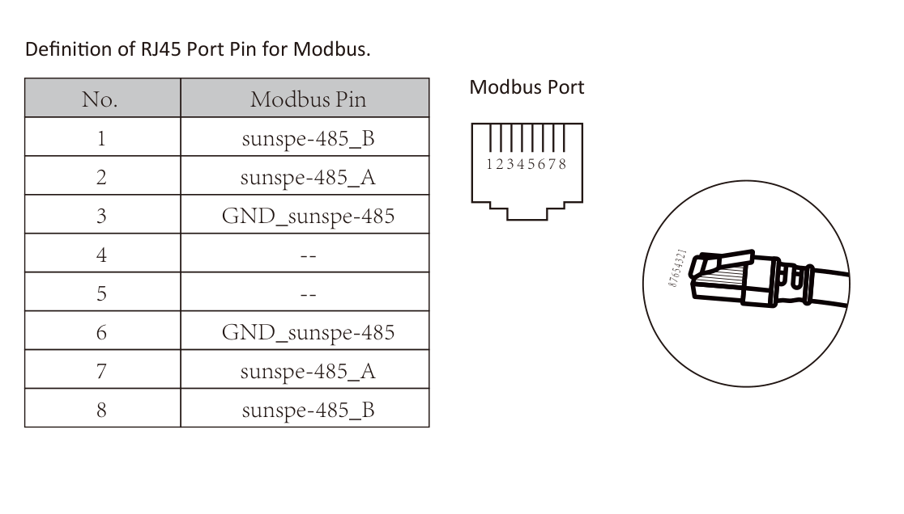

# Deye SUN-6K + Waveshare ESP32-S3-RS485-CAN

[English](../README.md) · [Fuentes](SOURCES.md)

Integración ESPHome Modbus RTU de solo lectura para:

- Deye `SUN-6K-SG05LP1-EU-AM2-P`
- Waveshare `ESP32-S3-RS485-CAN`
- [Comprar la placa en Amazon](https://amzn.to/4fxuGVk)
- [Fuente DIN opcional de 12 V DC](https://amzn.to/4vEIxz0)

## Happy path probado

Usar exactamente esta topología:

1. Puerto RJ45 dedicado del inversor rotulado **`Modbus`**.
2. Un único cable CAT/Ethernet continuo; sin splitter, acoplador, ramal BMS, ramal Meter ni segundo maestro.
3. Conectar exclusivamente los pines **1 y 2**:

| RJ45 Modbus Deye | Borne RS485 Waveshare |
|---|---|
| Pin 1 — `B` | `B-` |
| Pin 2 — `A` | `A+` |
| Pines 3–8 | Sin conectar |

RJ45 es solo el conector: la comunicación es RS485/Modbus RTU, no Ethernet de red.



*Recorte sin modificar del manual oficial Deye, página impresa 53.*

UART y control de dirección Waveshare:

```yaml
uart:
  tx_pin: GPIO17
  rx_pin: GPIO18

modbus:
  flow_control_pin: GPIO21
```

`GPIO21` es obligatorio: sin él la placa transmitía, pero no conmutaba correctamente el transceptor RS485 para recibir.

Alimentar Waveshare por separado mediante USB-C 5 V o borne DC 7–36 V. No sacar alimentación del RJ45 Modbus. Si la fuente DIN se alimenta desde la salida AC Backup/Load, usar una derivación protegida; no conectarla directamente a bornes sin protección.

## Firmware

El repositorio ofrece intencionadamente un solo firmware:

[`deye-sun6k-waveshare-upstream-readonly.yaml`](../deye-sun6k-waveshare-upstream-readonly.yaml)

Fija un snapshot auditado derivado de [Lewa-Reka/esphome-deye-inverter](https://github.com/Lewa-Reka/esphome-deye-inverter). Aquí solo se activa su subconjunto de lectura. El repositorio upstream también ofrece controles de escritura del inversor; aquí no se exponen. Sus definiciones quedan únicamente como comentarios `READONLY-DISABLED` para poder auditarlas.

- [Auditoría por fichero de entidades escribibles](UPSTREAM-WRITE-ENTITY-AUDIT.es.md)
- [Notas del paquete copiado](../pv_inverter/README.md)
- CI rechaza cualquier `number`, `select`, `switch`, `button`, `datetime`, script o primitiva Modbus de escritura activa.

## Instalación con ESPHome Device Builder

1. Crear el dispositivo y conservar la clave API y contraseña OTA generadas.
2. Sustituir su YAML por el [YAML raw de solo lectura](https://raw.githubusercontent.com/scrhall/deye-sun6k-waveshare-esphome/main/deye-sun6k-waveshare-upstream-readonly.yaml).
3. Añadir al editor **SECRETS** las claves de [`secrets.example.yaml`](../secrets.example.yaml).
4. Configurar `Modbus SN = 01` en el inversor, o adaptar `modbus_inverter_address` al valor mostrado.
5. Pulsar **Validate** y después **Install**. Usar USB-C para el primer flasheo; después puede usarse OTA.

Parámetros validados físicamente: `9600 8N1`, esclavo `0x01`, función `03`. Ruta de pantalla: engranaje → `Advanced Function` → flechas hasta `Paral. Set3` → `Modbus SN`.

## Verificación en Home Assistant

Comprobación en vivo realizada el 2026-07-21:

- 86 entidades `sensor` y 2 `binary_sensor` reportando datos.
- Batería, FV, red, carga, temperaturas, acumulados, metadatos, alarmas y diagnóstico ESP.
- `Running Status = normal`, `Device Alarm = OK`, `Device Fault = OK`.
- Cero entidades `number`, `select`, `switch`, `button` o `datetime` para este dispositivo.

El número exacto puede cambiar en futuras versiones, pero los dominios de control escribibles deben permanecer en cero.

## Fuentes

- [Manual oficial Deye](https://www.deyeinverter.com/deyeinverter/2025/08/12/rand/5761/%5Bb%5Dmanual_sun-3.6-10k-sg05lp1-eu-am2-p_20250812_en.pdf)
- Waveshare oficial: [producto](https://www.waveshare.com/esp32-s3-rs485-can.htm), [wiki](https://www.waveshare.com/wiki/ESP32-S3-RS485-CAN), [demo](https://files.waveshare.com/wiki/ESP32-S3-RS485-CAN/ESP32-S3-RS485-CAN-Demo.zip) y [esquema](https://files.waveshare.com/wiki/ESP32-S3-RS485-CAN/ESP32-S3-RS485-CAN-Schematic.pdf)
- [ESPHome Modbus Controller](https://esphome.io/components/modbus_controller/)
- [Procedencia detallada](SOURCES.md)

Licencia MIT. Los ficheros upstream copiados conservan Apache-2.0. Proyecto no afiliado a Deye, Waveshare, Amazon, ESPHome ni Lewa-Reka.
