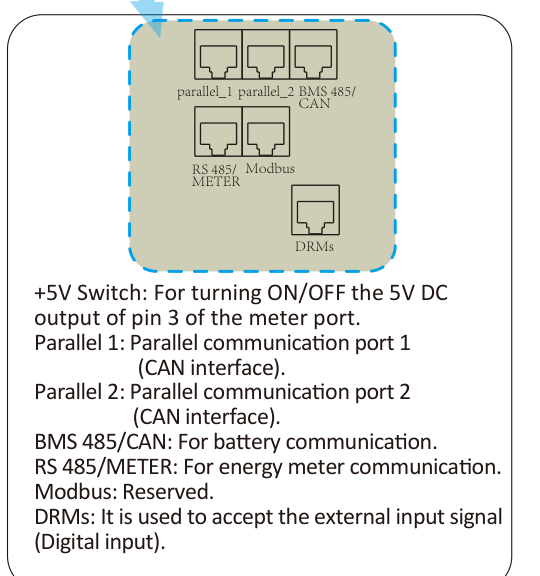
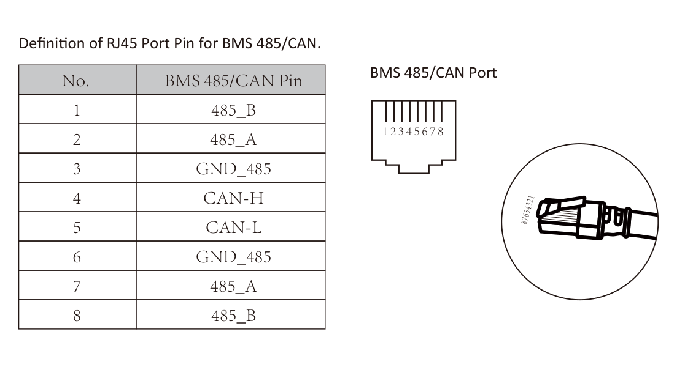

# Experimental shared BMS RJ45 breakout cable

[Español](SHARED-BMS-RJ45-CABLE.es.md)

> [!CAUTION]
> Prefer the dedicated inverter **`Modbus`** port. Deye documents `BMS 485/CAN` as a **battery communication** port, not as a telemetry Modbus port. Its RS485 pins may use a battery protocol and may not answer registers 183/184. This breakout is experimental and must not be used unless a read-only test confirms the expected Modbus response without affecting BMS communication.



*Crop from the official Deye manual, printed page 14: `BMS 485/CAN` for battery communication and `Modbus` reserved.*

## Never use this when

- The battery communicates with the inverter over RS485 instead of CAN.
- The exact inverter/battery pinout or active protocol is unknown.
- Battery alarms or BMS communication errors appear.
- A generic passive Ethernet splitter is the only available part. It parallels all eight conductors and can join two transceivers unintentionally.

## Inverter BMS port pinout

Official Deye manual, Appendix I, printed page 52:



*Unmodified crop from the official manual showing the complete table and connector orientation.*

| Pin | Signal |
|---:|---|
| 1 | `485_B` |
| 2 | `485_A` |
| 3 | `GND_485` |
| 4 | `CAN-H` |
| 5 | `CAN-L` |
| 6 | `GND_485` |
| 7 | `485_A` |
| 8 | `485_B` |

The manual shows the socket face-on, latch notch down, contacts at the top: pins 1→8 run left to right. Avoid relying on Ethernet wire colors; use numbered RJ45 breakout boards and verify every pin with a continuity tester.

## Proposed construction

The original BMS cable remains untouched. Insert a custom male-to-male extension and a straight-through female-to-female RJ45 coupler:

```text
Inverter BMS female RJ45
          │
          └── male A ── custom extension ── male B
                 │                           │
                 │                           └── straight-through RJ45 female-female coupler
                 │                                      │
                 │                                      └── original BMS cable ── battery PCS
                 │
                 ├── pin 1, 485_B ──→ Waveshare B-
                 └── pin 2, 485_A ──→ Waveshare A+
```

For a SE-F16 already verified to communicate over CAN on PCS pins 4/5, this is the complete mapping. Colors are references only when both pigtails really use T568B; always trust pin numbers verified by continuity.

| Pin | T568B color | Male A, inverter | Connection to male B | Side branch |
|---:|---|---|---|---|
| 1 | white/orange | `485_B` | **Do not connect** | Waveshare `B-` |
| 2 | orange | `485_A` | **Do not connect** | Waveshare `A+` |
| 3 | white/green | `GND_485` | **Do not connect** | None |
| 4 | blue | `CAN-H` | **Pin 4→pin 4, straight** | None |
| 5 | white/blue | `CAN-L` | **Pin 5→pin 5, straight** | None |
| 6 | green | `GND_485` | **Do not connect** | None |
| 7 | white/brown | `485_A` | **Do not connect** | None |
| 8 | brown | `485_B` | **Do not connect** | None |

Therefore, **nothing is crossed**. The RS485 branch leaves only from male A. Pins 1/2 do not continue to male B, the coupler, or the original BMS cable.

The female-to-female coupler itself must be fully straight-through:

```text
1→1  2→2  3→3  4→4  5→5  6→6  7→7  8→8
```

Although the coupler preserves all eight contacts, male B carries a useful signal only on 4/5; 1/2/3/6/7/8 arrive open from the custom extension.

### Can every pin except 1/2 pass through?

**Not as a safe default.** The manual labels 7/8 as another `485_A`/`485_B` pair; passing them carries the same RS485 bus toward the battery even when 1/2 are cut. Pins 3/6 are `GND_485`, not a documented CAN ground. For a battery confirmed on CAN, carry only 4/5. Add another conductor only when the exact battery-revision manual or a verified original-cable test proves it is required. If all eight pins must remain connected, do not share this port with a passive cable; use the dedicated `Modbus` port.

- Do not connect inverter pins 3/6 to Waveshare: its isolated RS485 terminal exposes only A+/B-.
- Leave duplicate RS485 pins 7/8 unused. Do not use both RS485 pairs.
- The female-to-female coupler must be straight-through, not crossover; verify 1→1, 2→2 … 8→8 with continuity mode.
- Preserve in the extension any CAN reference/ground conductor required by the exact battery revision and original cable. Confirm against that battery's manual and a continuity test; do not guess.
- This extension is not a complete Ethernet patch lead: do not carry pins 1/2/7/8 to the battery side. Carry only CAN 4/5 and any additional reference conductor already verified.
- Keep the battery CAN branch straight-through and short. Keep the RS485 branch short for the first test.

## Parts

- Custom extension with two RJ45 male plugs: **male A** to inverter, **male B** to coupler.
- Straight-through 8P8C female-to-female RJ45 coupler.
- Original BMS cable, uncut and unmodified.
- A+/B- twisted pair to Waveshare.
- Insulated junction box beside male A, multimeter, strain relief, and labels.

Do not use a crimped Y cable until the breakout version has passed every test.

### Simple method using one T568B patch lead

1. Use one straight-through male-to-male T568B patch lead and cut it in the middle: one half becomes male A and the other male B.
2. Bring both cut ends into a terminal enclosure.
3. Join A blue↔B blue (pin 4) and A white/blue↔B white/blue (pin 5).
4. Route male-A white/orange (pin 1) to `B-` and male-A orange (pin 2) to `A+`.
5. Individually insulate every other conductor on both sides. Do not join them.
6. Verify by pin number; if colors do not exactly match T568B, ignore them and map with continuity mode.

## Build and verify

1. Shut down and isolate inverter, battery, and ESP supply according to their manuals.
2. Photograph and label every connector. Confirm the battery is configured for CAN.
3. Map the original BMS cable and female-to-female coupler pin by pin with continuity mode.
4. Build the male A→male B extension. Carry 4→4 and 5→5; add only a separately confirmed CAN reference conductor.
5. In the male-A junction box, branch pin 1→Waveshare B- and pin 2→A+. Do not carry 1/2/7/8 to male B.
6. Check end-to-end: inverter 4→PCS 4, inverter 5→PCS 5, inverter 1→B- only, and inverter 2→A+ only. Every other destination must be open except verified reference conductors. Never use continuity mode on energized equipment.
7. Reconnect the battery branch **without ESP connected**. Start the system and confirm normal battery SOC, voltage, and no BMS alarm.
8. Power the ESP separately, then connect A+/B-. Run the [two-register read test](FIRST-READ-TEST.md).
9. If Modbus does not answer, disconnect the ESP branch. Do not assume another baud rate or write registers.

## Abort immediately

Disconnect the ESP branch if SOC disappears, the inverter reports BMS/CAN faults, charging behavior changes, either transceiver becomes hot, or readings are unstable. Restore the original battery cable before further diagnosis.

## Sources

- [Official Deye inverter manual](https://www.deyeinverter.com/deyeinverter/2025/08/12/rand/5761/%5Bb%5Dmanual_sun-3.6-10k-sg05lp1-eu-am2-p_20250812_en.pdf): port purpose on printed page 14; BMS RJ45 pinout on printed page 52.
- [Official SE-F16 manual V06](https://deyeess.com/wp-content/uploads/2025/12/Deye-ESS-User-Manual-SE-F16-EU-EN-V06.pdf): verify the PCS pinout for the exact battery revision before building. The official server returned HTTP 403 during this document's review, so its pinout was not independently revalidated here.
